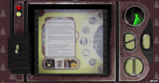

# Detector - Retro Wasteland

- A real-time rendering 3D scene using WebGL (ThreeJS) to mock a retro-style button-interaction device displaying information of nostalgic items.
- JavaScript, Three,js, Pixi,js, GLSL, Node.js, Express.js, Blender, Adobe Suite

**Click here to play with the deployed 3d scene: [3D Detector](https://ui-request.vercel.app/)**

## How to play with it

- First, click the left-side yellow switch to turn on the screen.
  

- Then click right side buttons to navigate the UI:

  - Left and right buttons to shift among items list, items info, items collection and video pop-up
  - Up and down buttons to change items when in the items list, and to browse the item text when in the items info
  - Rightmost button to select one item or cancel one item when in the items list

    the little little gif demonstration\
     
